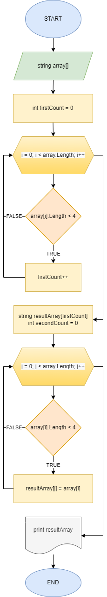

# Контрольная работа Зюкова Егора

### Написать программу, которая из имеющегося массива строк формирует 
### массив из строк, длина которых меньше либо равна 3 символа.

1. Составлена блок-схема решения поставленой задачи



2. Написаны методы для ввода данных пользователем и захвата данных в массив

```  
  string StringsInput(string text)
  {
    Console.Write($"{text}: ");
    string numbers = Console.ReadLine()!;
    return numbers;
  }
  
  
  string[] InputArray(string num)
  {
    char[] separators = new char[] {',', ' '};
    string[] array = num.Split(separators, StringSplitOptions.RemoveEmptyEntries);
    string[] newArray = new string[array.Length];
    for (int i = 0; i < array.Length; i++)
    {
      newArray[i] = array[i];
    }
    return newArray;
  }
```

3. Написан метод для подсчета элементов, удовлетворяющих критериям отбора

```
int SearchSize(string[] array)
{
    int count = 0;
    for (int i = 0; i < array.Length; i++)
    {
        if (array[i].Length < 4) count ++;
        
    }
    return count;
}
```

4. Написан метод, копирующий элементы, удовлетворяющие критериям, из введенного массива в итоговый массив

```
string[] ArraySorting (string[] array, int size)
{
    string[] newArray = new string[size];
    int count = 0;
    for (int i = 0; i < array.Length; i++)
    {
        if (array[i].Length < 4) 
        {
            newArray[count] = array[i];
            count++;
        }
    }
    return newArray;
}
```

5. Добавлен метод печати результатов программы

```
void PrintResult(string[] inputArray, string[] finalArray)
{
    Console.WriteLine($"Вы ввели строки: {String.Join(", ", inputArray)}");
    Console.WriteLine($"Из них строки, длина которых меньше или равна 3 символа: {String.Join(", ", finalArray)}");
}
```

6. Дописан главный метод

```
void main()
{
    Console.Clear();
    string input = StringsInput("Введите строки через пробел или запятую");
    string[] inputArray = InputArray(input);
    int finalArraySize = SearchSize(inputArray);
    string[] finalArray = ArraySorting(inputArray, finalArraySize);
    PrintResult(inputArray, finalArray);
}
```
